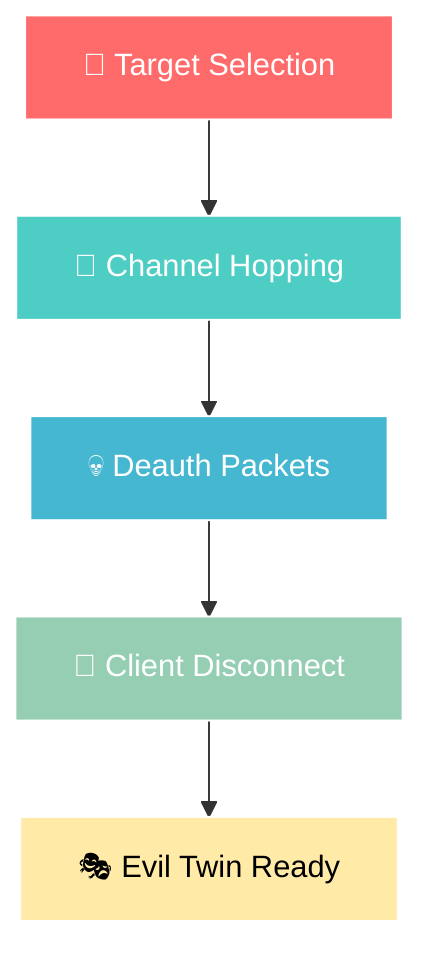

<p align="center">
  
</p>

<p align="center">
  
  
  
  
</p>

<p align="center">
  
  
  
</p>

---

<h2 align="center">⚡ A Comprehensive ESP8266-Based WiFi Security Research Toolkit ⚡</h2>

<p align="center">
  <em>🔐 Professional-grade penetration testing tools for authorized security research, CTF competitions, and educational purposes.</em>
</p>

---

## 🎯 Overview

```
┌──────────────────────────────────────────────────────────────────────────────┐
│                         🛡️  HARDWARE HACKING ARSENAL  🛡️                     │
├──────────────────────────────────────────────────────────────────────────────┤
│                                                                              │
│    ╔═══════════════╗    ╔══════════════════╗    ╔═════════════════════╗     │
│    ║  🌐 WiFi      ║    ║  🎭 Evil Twin    ║    ║  🦆 USB Rubber      ║     │
│    ║  Deauther    ║──▶ ║  Attack Suite   ║──▶ ║  Ducky Scripts     ║     │
│    ╚═══════════════╝    ╚══════════════════╝    ╚═════════════════════╝     │
│           │                      │                        │                 │
│           ▼                      ▼                        ▼                 │
│    ┌─────────────┐        ┌──────────────┐        ┌───────────────┐        │
│    │  802.11     │        │  Captive     │        │  Credential   │        │
│    │  Deauth     │        │  Portal      │        │  Harvesting   │        │
│    │  Frames     │        │  Generator   │        │  Automation   │        │
│    └─────────────┘        └──────────────┘        └───────────────┘        │
│                                                                              │
└──────────────────────────────────────────────────────────────────────────────┘
```

---

## 📦 Repository Structure

```
🗂️ Hardware-Hacking/
│
├── 📁 Arduino/
│   ├── 🔧 Arduino Libraries/          # Required ESP8266 Libraries
│   ├── 🔧 CH34x_Install_Windows/       # CH340/CH341 USB Driver
│   ├── 🔧 CP210x_Windows_Drivers/      # CP2102 USB Driver
│   ├── ⚙️ Config/                      # Device MAC Configurations
│   ├── 📄 ESP8266Flasher.exe           # Firmware Flashing Tool
│   └── 📄 arduino-1.8.18-windows.exe   # Arduino IDE Installer
│
├── 📁 Wi-Fi Deauther (ESP8266)/
│   └── 📄 esp8266_deauther_2.6.1.bin   # Pre-compiled Deauther Firmware
│
├── 📁 WIFI-RA-Phishi/
│   └── 📁 ESP8266_PhiSiFi/
│       └── 📄 ESP8266_PhiSiFi.ino      # Evil Twin + Deauth Attack
│
├── 📁 Wi-Fi Honey Phisher/
│   └── 📁 Wifi_Honey_Phisher/
│       └── 📄 Wifi_Honey_Phisher.ino   # Captive Portal Phishing
│
└── 📁 USB Rubber Ducky/
    ├── 📄 Wifi_Password_Stealer.vbs    # WiFi Credential Extractor
    ├── 📄 browser_password.vbs         # Browser Password Harvester
    └── 📄 browser_history.vbs          # Browser History Extractor
```

---

## 🚀 Features & Tools

### 🌐 Wi-Fi Deauther (ESP8266)
<table>
<tr>
<td width="50%">



</td>
<td width="50%">

**✨ Key Features:**
- 📶 Scan & display nearby WiFi networks
- 🎯 Target specific access points
- 💥 Send continuous deauth frames
- 📊 Web-based control interface
- 🔄 Multi-client attack support

**📋 Specifications:**
| Feature | Value |
|---------|-------|
| Frequency | 2.4 GHz |
| Packets/sec | ~200 |
| Range | Up to 100m |
| Channels | 1-14 |

</td>
</tr>
</table>

---

### 🎭 ESP8266 PhiSiFi (Evil Twin Attack)
<table>
<tr>
<td width="60%">

**🔥 Attack Chain:**

```
┌─────────────────────────────────────────────────────────────┐
│                    EVIL TWIN ATTACK FLOW                    │
├─────────────────────────────────────────────────────────────┤
│                                                             │
│  ┌──────────┐        ┌──────────┐        ┌──────────────┐  │
│  │ 1️⃣ SCAN  │───────▶│ 2️⃣ CLONE │───────▶│ 3️⃣ DEAUTH    │  │
│  │ Networks │        │   SSID   │        │ Real AP      │  │
│  └──────────┘        └──────────┘        └──────────────┘  │
│                                                  │          │
│                                                  ▼          │
│  ┌──────────┐        ┌──────────┐        ┌──────────────┐  │
│  │ 6️⃣ VALID │◀───────│ 5️⃣ CAPTURE│◀──────│ 4️⃣ CAPTIVE   │  │
│  │ Password │        │ Password │        │ PORTAL       │  │
│  └──────────┘        └──────────┘        └──────────────┘  │
│                                                             │
└─────────────────────────────────────────────────────────────┘
```

</td>
<td width="40%">

**🎯 Capabilities:**
- 🔍 Auto WiFi scanning
- 📡 SSID cloning
- 💀 Integrated deauthentication
- 🌐 Captive portal injection
- ✅ Real-time password validation
- 📱 Mobile-responsive UI

</td>
</tr>
</table>

---

### 🍯 WiFi Honey Phisher (Captive Portal)

<p align="center">

| Phase | Description | Action |
|:-----:|:------------|:-------|
| 🏪 | **Portal Setup** | Creates fake public WiFi access point |
| 👥 | **User Connect** | Victim connects to the open network |
| 📝 | **Data Capture** | Collects credentials via login form |
| 💾 | **Storage** | Stores harvested data in memory |
| 🔔 | **Notification** | LED blinks on successful capture |

</p>

**🎨 Sample Portal Interface:**
```
╔════════════════════════════════════════════╗
║       🌐 FREE WIFI - WELCOME               ║
╠════════════════════════════════════════════╣
║                                            ║
║   📧 Name: [________________]              ║
║                                            ║
║   📱 Mobile: [________________]            ║
║                                            ║
║          [    Sign In    ]                 ║
║                                            ║
╚════════════════════════════════════════════╝
```

---

### 🦆 USB Rubber Ducky Scripts

<table>
<tr>
<td>

#### 📶 WiFi Password Stealer
```
┌────────────────────────────────┐
│   🔐 WIFI CREDENTIAL DUMP     │
├────────────────────────────────┤
│ ✓ Enumerate saved networks    │
│ ✓ Extract stored passwords    │
│ ✓ Export to local file        │
│ ✓ Silent execution            │
└────────────────────────────────┘
```

</td>
<td>

#### 🔑 Browser Password Harvester
```
┌────────────────────────────────┐
│   🌐 BROWSER CRED EXTRACTOR   │
├────────────────────────────────┤
│ ✓ Chrome passwords            │
│ ✓ Firefox credentials         │
│ ✓ Edge saved logins           │
│ ✓ SQLite database parsing     │
└────────────────────────────────┘
```

</td>
</tr>
</table>

---

## 🛠️ Hardware Requirements

<p align="center">

| Component | Model | Purpose | Price Range |
|:---------:|:-----:|:--------|:-----------:|
| 🎛️ | **ESP8266** | Main MCU for WiFi attacks | $2 - $8 |
| 📻 | **NodeMCU** | Development board with USB | $4 - $10 |
| 🔌 | **CH340/CP2102** | USB-to-Serial converter | $1 - $3 |
| 📡 | **External Antenna** | Extended range (optional) | $3 - $15 |
| 💻 | **USB Drive** | Rubber Ducky alternative | $5 - $20 |

</p>

### 🔧 Recommended Modules

```
┌─────────────────────────────────────────────────────────────────────┐
│                     HARDWARE RECOMMENDATIONS                         │
├─────────────┬─────────────┬──────────────────┬─────────────────────┤
│    🏆       │    ⭐       │       📡          │        💰          │
│   Best      │  Budget     │    Long Range     │     Premium        │
├─────────────┼─────────────┼──────────────────┼─────────────────────┤
│  NodeMCU    │  ESP-01     │   ESP8266 + SMA   │   ESP8266 Deauther │
│  V3/V2      │  Module     │   External Ant    │   OLED Watch       │
└─────────────┴─────────────┴──────────────────┴─────────────────────┘
```

---

## ⚡ Quick Start Guide

### 📥 Installation Steps

<details>
<summary><b>1️⃣ Install Arduino IDE & Drivers</b></summary>

```bash
# Step 1: Install Arduino IDE
📁 Arduino/arduino-1.8.18-windows.exe

# Step 2: Install USB Drivers (choose based on your board)
📁 Arduino/CH34x_Install_Windows_v3_4/     # For CH340 chips
📁 Arduino/CP210x_Windows_Drivers/          # For CP2102 chips
```

</details>

<details>
<summary><b>2️⃣ Configure Arduino for ESP8266</b></summary>

```
1. Open Arduino IDE
2. Go to: File → Preferences
3. Add to "Additional Board Manager URLs":
   
   http://arduino.esp8266.com/stable/package_esp8266com_index.json

4. Go to: Tools → Board → Board Manager
5. Search "ESP8266" and install
6. Select: Tools → Board → NodeMCU 1.0 (ESP-12E Module)
```

</details>

<details>
<summary><b>3️⃣ Install Required Libraries</b></summary>

```
📁 Arduino/Arduino Libraries.zip

Extract and copy to:
C:\Users\<username>\Documents\Arduino\libraries\
```

</details>

<details>
<summary><b>4️⃣ Flash & Deploy</b></summary>

**Option A: Flash Pre-compiled Firmware**
```bash
# Use ESP8266Flasher.exe
📁 Arduino/ESP8266Flasher.exe

# Select firmware:
📁 Wi-Fi Deauther (ESP8266)/esp8266_deauther_2.6.1_NODEMCU.bin
```

**Option B: Compile from Source**
```bash
# Open sketch in Arduino IDE:
📁 WIFI-RA-Phishi/ESP8266_PhiSiFi/ESP8266_PhiSiFi.ino
# or
📁 Wi-Fi Honey Phisher/Wifi_Honey_Phisher/Wifi_Honey_Phisher.ino

# Click Upload (→) button
```

</details>

---

## 📡 Usage Guide

### 🎮 Control Interfaces

```
╔════════════════════════════════════════════════════════════════╗
║                    📱 WEB INTERFACE ACCESS                      ║
╠════════════════════════════════════════════════════════════════╣
║                                                                 ║
║   🌐 Deauther Dashboard        →  http://192.168.4.1           ║
║   🎭 Evil Twin Admin Panel     →  http://192.168.4.1/admin     ║
║   🍯 Honey Phisher Creds       →  http://172.0.0.1/pass        ║
║                                                                 ║
╚════════════════════════════════════════════════════════════════╝
```

### 🔌 Connection Steps


---

## ⚠️ Legal Disclaimer

> [!CAUTION]
> **🚨 IMPORTANT LEGAL NOTICE 🚨**
> 
> This toolkit is provided for **EDUCATIONAL PURPOSES ONLY**. Unauthorized access to computer networks is illegal in most jurisdictions.
> 
> **Before using these tools, ensure you have:**
> - ✅ Written permission from the network owner
> - ✅ Legal authorization for penetration testing
> - ✅ Understanding of applicable laws in your jurisdiction
> 
> **The author assumes NO responsibility for misuse of this software.**

<p align="center">
  
</p>

---

## 🎓 Educational Use Cases

<table>
<tr>
<td align="center" width="25%">
<h3>🏫</h3>
<b>Academia</b>
<br><br>
Network Security Courses
Wireless Protocol Research
</td>
<td align="center" width="25%">
<h3>🏆</h3>
<b>CTF Competitions</b>
<br><br>
Capture The Flag Events
Red Team Exercises
</td>
<td align="center" width="25%">
<h3>🔒</h3>
<b>Security Audits</b>
<br><br>
Authorized Pentesting
Vulnerability Assessment
</td>
<td align="center" width="25%">
<h3>📚</h3>
<b>Self-Learning</b>
<br><br>
Understanding WiFi Security
Protocol Analysis
</td>
</tr>
</table>

---

## 🤝 Contributing

<p align="center">
  Contributions are welcome! Please feel free to submit a Pull Request.
</p>

```
🔀 Fork the repository
🌿 Create your feature branch (git checkout -b feature/AmazingFeature)
💾 Commit your changes (git commit -m 'Add some AmazingFeature')
📤 Push to the branch (git push origin feature/AmazingFeature)
📝 Open a Pull Request
```

---

## 📫 Connect With Me

<p align="center">
  <a href="https://github.com/hackwithvishnu">
    
  </a>
  <a href="https://www.linkedin.com/in/vishnu-vijayan-vs/">
    
  </a>
  <a href="https://www.instagram.com/hackwithvishnu/">
    
  </a>
</p>

---

## ⭐ Star History

<p align="center">
  If you find this project useful, please consider giving it a ⭐!
</p>

---

<p align="center">
  
</p>

<p align="center">
  Made with ❤️ by <a href="https://github.com/hackwithvishnu">@hackwithvishnu</a>
</p>

<p align="center">
  
</p>

---

<p align="center">
  <sub>🔒 Remember: With great power comes great responsibility 🔒</sub>
</p>
